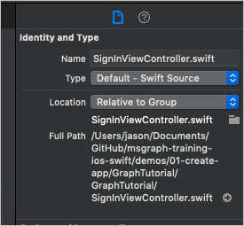
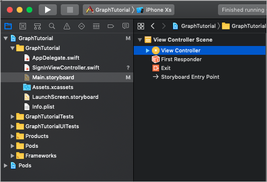
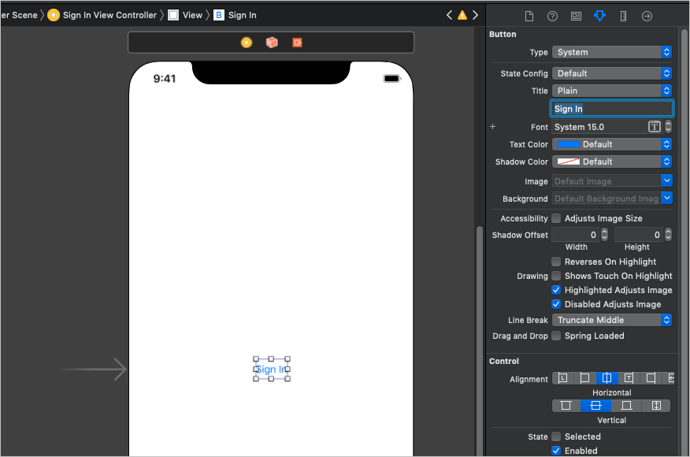
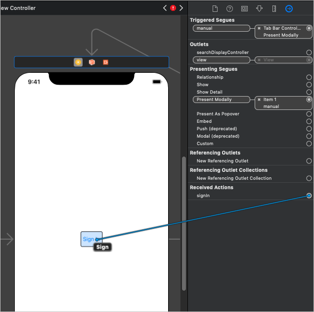
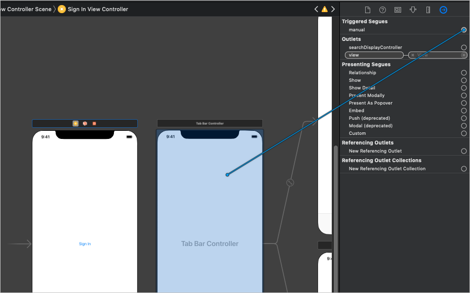

<!-- markdownlint-disable MD002 MD041 -->

<span data-ttu-id="a470d-101">Comece criando um novo projeto Swift.</span><span class="sxs-lookup"><span data-stu-id="a470d-101">Begin by creating a new Swift project.</span></span>

1. <span data-ttu-id="a470d-102">Abra o Xcode.</span><span class="sxs-lookup"><span data-stu-id="a470d-102">Open Xcode.</span></span> <span data-ttu-id="a470d-103">No menu **arquivo** , selecione **novo**e, em seguida, **projeto**.</span><span class="sxs-lookup"><span data-stu-id="a470d-103">On the **File** menu, select **New**, then **Project**.</span></span>
1. <span data-ttu-id="a470d-104">Escolha o modelo de **aplicativo exibir único** e selecione **Avançar**.</span><span class="sxs-lookup"><span data-stu-id="a470d-104">Choose the **Single View App** template and select **Next**.</span></span>

    

1. <span data-ttu-id="a470d-106">Defina o **nome** do produto `GraphTutorial` como e o **idioma** como **Swift**.</span><span class="sxs-lookup"><span data-stu-id="a470d-106">Set the **Product Name** to `GraphTutorial` and the **Language** to **Swift**.</span></span>
1. <span data-ttu-id="a470d-107">Preencha os campos restantes e selecione **Avançar**.</span><span class="sxs-lookup"><span data-stu-id="a470d-107">Fill in the remaining fields and select **Next**.</span></span>
1. <span data-ttu-id="a470d-108">Escolha um local para o projeto e selecione **criar**.</span><span class="sxs-lookup"><span data-stu-id="a470d-108">Choose a location for the project and select **Create**.</span></span>

## <a name="install-dependencies"></a><span data-ttu-id="a470d-109">Instalar dependências</span><span class="sxs-lookup"><span data-stu-id="a470d-109">Install dependencies</span></span>

<span data-ttu-id="a470d-110">Antes de prosseguir, instale algumas dependências adicionais que serão usadas posteriormente.</span><span class="sxs-lookup"><span data-stu-id="a470d-110">Before moving on, install some additional dependencies that you will use later.</span></span>

- <span data-ttu-id="a470d-111">[Biblioteca de autenticação da Microsoft (MSAL) para IOS](https://github.com/AzureAD/microsoft-authentication-library-for-objc) para autenticação com o Azure AD.</span><span class="sxs-lookup"><span data-stu-id="a470d-111">[Microsoft Authentication Library (MSAL) for iOS](https://github.com/AzureAD/microsoft-authentication-library-for-objc) for authenticating to with Azure AD.</span></span>
- <span data-ttu-id="a470d-112">[SDK do Microsoft Graph para o objetivo C](https://github.com/microsoftgraph/msgraph-sdk-objc) para fazer chamadas para o Microsoft Graph.</span><span class="sxs-lookup"><span data-stu-id="a470d-112">[Microsoft Graph SDK for Objective C](https://github.com/microsoftgraph/msgraph-sdk-objc) for making calls to Microsoft Graph.</span></span>
- <span data-ttu-id="a470d-113">[SDK de modelos do Microsoft Graph para o objetivo C](https://github.com/microsoftgraph/msgraph-sdk-objc-models) para objetos fortemente tipados que representam os recursos do Microsoft Graph, como usuários ou eventos.</span><span class="sxs-lookup"><span data-stu-id="a470d-113">[Microsoft Graph Models SDK for Objective C](https://github.com/microsoftgraph/msgraph-sdk-objc-models) for strongly-typed objects representing Microsoft Graph resources like users or events.</span></span>

1. <span data-ttu-id="a470d-114">Encerre o Xcode.</span><span class="sxs-lookup"><span data-stu-id="a470d-114">Quit Xcode.</span></span>
1. <span data-ttu-id="a470d-115">Abra o terminal e altere o diretório para o local do seu projeto do **GraphTutorial** .</span><span class="sxs-lookup"><span data-stu-id="a470d-115">Open Terminal and change the directory to the location of your **GraphTutorial** project.</span></span>
1. <span data-ttu-id="a470d-116">Execute o comando a seguir para criar um Podfile.</span><span class="sxs-lookup"><span data-stu-id="a470d-116">Run the following command to create a Podfile.</span></span>

    ```Shell
    pod init
    ```

1. <span data-ttu-id="a470d-117">Abra o Podfile e adicione as seguintes linhas logo após a `use_frameworks!` linha.</span><span class="sxs-lookup"><span data-stu-id="a470d-117">Open the Podfile and add the following lines just after the `use_frameworks!` line.</span></span>

    ```Ruby
    pod 'MSAL', '~> 1.0.2'
    pod 'MSGraphClientSDK', ' ~> 1.0.0'
    pod 'MSGraphClientModels', '~> 1.3.0'
    ```

1. <span data-ttu-id="a470d-118">Salve o Podfile e execute o seguinte comando para instalar as dependências.</span><span class="sxs-lookup"><span data-stu-id="a470d-118">Save the Podfile, then run the following command to install the dependencies.</span></span>

    ```Shell
    pod install
    ```

1. <span data-ttu-id="a470d-119">Quando o comando for concluído, abra o **GraphTutorial. xcworkspace** recém-criado no Xcode.</span><span class="sxs-lookup"><span data-stu-id="a470d-119">Once the command completes, open the newly created **GraphTutorial.xcworkspace** in Xcode.</span></span>

## <a name="design-the-app"></a><span data-ttu-id="a470d-120">Projetar o aplicativo</span><span class="sxs-lookup"><span data-stu-id="a470d-120">Design the app</span></span>

<span data-ttu-id="a470d-121">Nesta seção, você criará os modos de exibição do aplicativo: uma página de entrada, um navegador de barra de guias, uma página de boas-vindas e uma página de calendário.</span><span class="sxs-lookup"><span data-stu-id="a470d-121">In this section you will create the views for the app: a sign in page, a tab bar navigator, a welcome page, and a calendar page.</span></span> <span data-ttu-id="a470d-122">Você também criará uma sobreposição de indicador de atividade.</span><span class="sxs-lookup"><span data-stu-id="a470d-122">You'll also create an activity indicator overlay.</span></span>

### <a name="create-sign-in-page"></a><span data-ttu-id="a470d-123">Criar página de entrada</span><span class="sxs-lookup"><span data-stu-id="a470d-123">Create sign in page</span></span>

1. <span data-ttu-id="a470d-124">Expanda a pasta **GraphTutorial** no Xcode e selecione **ViewController. Swift**.</span><span class="sxs-lookup"><span data-stu-id="a470d-124">Expand the **GraphTutorial** folder in Xcode, then select **ViewController.swift**.</span></span>
1. <span data-ttu-id="a470d-125">No **Inspetor de arquivos**, altere o **nome** do arquivo para `SignInViewController.swift`.</span><span class="sxs-lookup"><span data-stu-id="a470d-125">In the **File Inspector**, change the **Name** of the file to `SignInViewController.swift`.</span></span>

    

1. <span data-ttu-id="a470d-127">Abra **SignInViewController. Swift** e substitua seu conteúdo pelo código a seguir.</span><span class="sxs-lookup"><span data-stu-id="a470d-127">Open **SignInViewController.swift** and replace its contents with the following code.</span></span>

    ```Swift
    import UIKit

    class SignInViewController: UIViewController {

        override func viewDidLoad() {
            super.viewDidLoad()
            // Do any additional setup after loading the view.
        }

        @IBAction func signIn() {
            self.performSegue(withIdentifier: "userSignedIn", sender: nil)
        }
    }
    ```

1. <span data-ttu-id="a470d-128">Abra o arquivo **Main. Storyboard** .</span><span class="sxs-lookup"><span data-stu-id="a470d-128">Open the **Main.storyboard** file.</span></span>
1. <span data-ttu-id="a470d-129">Expanda **Exibir controle cena**e selecione **Exibir controlador**.</span><span class="sxs-lookup"><span data-stu-id="a470d-129">Expand **View Controller Scene**, then select **View Controller**.</span></span>

    

1. <span data-ttu-id="a470d-131">Selecione o **Inspetor de identidade**e, em seguida, altere o menu suspenso de **classe** para **SignInViewController**.</span><span class="sxs-lookup"><span data-stu-id="a470d-131">Select the **Identity Inspector**, then change the **Class** dropdown to **SignInViewController**.</span></span>

    

1. <span data-ttu-id="a470d-133">Selecione a **biblioteca**e arraste um **botão** para o **controlador de exibição de entrada**.</span><span class="sxs-lookup"><span data-stu-id="a470d-133">Select the **Library**, then drag a **Button** onto the **Sign In View Controller**.</span></span>

    

1. <span data-ttu-id="a470d-135">Com o botão selecionado, selecione o **Inspetor de atributos** e altere o **título** do botão para `Sign In`.</span><span class="sxs-lookup"><span data-stu-id="a470d-135">With the button selected, select the **Attributes Inspector** and change the **Title** of the button to `Sign In`.</span></span>

    

1. <span data-ttu-id="a470d-137">Selecione o **controlador de exibição de entrada**e, em seguida, selecione o **Inspetor de conexões**.</span><span class="sxs-lookup"><span data-stu-id="a470d-137">Select the **Sign In View Controller**, then select the **Connections Inspector**.</span></span>
1. <span data-ttu-id="a470d-138">Em **ações recebidas**, arraste o círculo não preenchido ao lado de **entrar** no botão.</span><span class="sxs-lookup"><span data-stu-id="a470d-138">Under **Received Actions**, drag the unfilled circle next to **signIn** onto the button.</span></span> <span data-ttu-id="a470d-139">Selecione **retoque** no menu pop-up.</span><span class="sxs-lookup"><span data-stu-id="a470d-139">Select **Touch Up Inside** on the pop-up menu.</span></span>

    

1. <span data-ttu-id="a470d-141">No menu **Editor** , selecione **resolver problemas de layout automático**e, em seguida, selecione **Adicionar restrições ausentes** abaixo **de todas as exibições na controladora de exibição de entrada**.</span><span class="sxs-lookup"><span data-stu-id="a470d-141">On the **Editor** menu, select **Resolve Auto Layout Issues**, then select **Add Missing Constraints** underneath **All Views in Sign In View Controller**.</span></span>

### <a name="create-tab-bar"></a><span data-ttu-id="a470d-142">Criar barra de guias</span><span class="sxs-lookup"><span data-stu-id="a470d-142">Create tab bar</span></span>

1. <span data-ttu-id="a470d-143">Selecione a **biblioteca**e, em seguida, arraste um **controlador da barra de guias** para o storyboard.</span><span class="sxs-lookup"><span data-stu-id="a470d-143">Select the **Library**, then drag a **Tab Bar Controller** onto the storyboard.</span></span>
1. <span data-ttu-id="a470d-144">Selecione o **controlador de exibição de entrada**e, em seguida, selecione o **Inspetor de conexões**.</span><span class="sxs-lookup"><span data-stu-id="a470d-144">Select the **Sign In View Controller**, then select the **Connections Inspector**.</span></span>
1. <span data-ttu-id="a470d-145">Em **segues disparado**, arraste o círculo não preenchido ao lado de **manual** no **controlador da barra de guias** no storyboard.</span><span class="sxs-lookup"><span data-stu-id="a470d-145">Under **Triggered Segues**, drag the unfilled circle next to **manual** onto the **Tab Bar Controller** on the storyboard.</span></span> <span data-ttu-id="a470d-146">Selecione **Mostrar modalmente** no menu pop-up.</span><span class="sxs-lookup"><span data-stu-id="a470d-146">Select **Present Modally** in the pop-up menu.</span></span>

    

1. <span data-ttu-id="a470d-148">Selecione o segue que você acabou de adicionar e, em seguida, selecione o **Inspetor de atributos**.</span><span class="sxs-lookup"><span data-stu-id="a470d-148">Select the segue you just added, then select the **Attributes Inspector**.</span></span> <span data-ttu-id="a470d-149">Definir o campo **identificador** como `userSignedIn`e definir a **apresentação** como **tela inteira**.</span><span class="sxs-lookup"><span data-stu-id="a470d-149">Set the **Identifier** field to `userSignedIn`, and set **Presentation** to **Full Screen**.</span></span>

    

1. <span data-ttu-id="a470d-151">Selecione o **Item 1 cena**e, em seguida, selecione o **Inspetor de conexões**.</span><span class="sxs-lookup"><span data-stu-id="a470d-151">Select the **Item 1 Scene**, then select the **Connections Inspector**.</span></span>
1. <span data-ttu-id="a470d-152">Em **segues disparado**, arraste o círculo não preenchido ao lado de **manual** no **controlador de exibição de entrada** no storyboard.</span><span class="sxs-lookup"><span data-stu-id="a470d-152">Under **Triggered Segues**, drag the unfilled circle next to **manual** onto the **Sign In View Controller** on the storyboard.</span></span> <span data-ttu-id="a470d-153">Selecione **Mostrar modalmente** no menu pop-up.</span><span class="sxs-lookup"><span data-stu-id="a470d-153">Select **Present Modally** in the pop-up menu.</span></span>
1. <span data-ttu-id="a470d-154">Selecione o segue que você acabou de adicionar e, em seguida, selecione o **Inspetor de atributos**.</span><span class="sxs-lookup"><span data-stu-id="a470d-154">Select the segue you just added, then select the **Attributes Inspector**.</span></span> <span data-ttu-id="a470d-155">Definir o campo **identificador** como `userSignedOut`e definir a **apresentação** como **tela inteira**.</span><span class="sxs-lookup"><span data-stu-id="a470d-155">Set the **Identifier** field to `userSignedOut`, and set **Presentation** to **Full Screen**.</span></span>

### <a name="create-welcome-page"></a><span data-ttu-id="a470d-156">Criar página de boas-vindas</span><span class="sxs-lookup"><span data-stu-id="a470d-156">Create welcome page</span></span>

1. <span data-ttu-id="a470d-157">Selecione o arquivo **assets. xcassets** .</span><span class="sxs-lookup"><span data-stu-id="a470d-157">Select the **Assets.xcassets** file.</span></span>
1. <span data-ttu-id="a470d-158">No menu **Editor** , selecione **Adicionar ativos**e, em seguida, **novo conjunto de imagens**.</span><span class="sxs-lookup"><span data-stu-id="a470d-158">On the **Editor** menu, select **Add Assets**, then **New Image Set**.</span></span>
1. <span data-ttu-id="a470d-159">Selecione o novo ativo de **imagem** e use o **Inspetor de atributos** para definir seu `DefaultUserPhoto` **nome** como.</span><span class="sxs-lookup"><span data-stu-id="a470d-159">Select the new **Image** asset and use the **Attribute Inspector** to set its **Name** to `DefaultUserPhoto`.</span></span>
1. <span data-ttu-id="a470d-160">Adicione qualquer imagem que você deseja que sirva como uma foto de perfil de usuário padrão.</span><span class="sxs-lookup"><span data-stu-id="a470d-160">Add any image you like to serve as a default user profile photo.</span></span>

    

1. <span data-ttu-id="a470d-162">Crie um novo arquivo de **classe Touch** do Cocoa \*\*\*\* na pasta GraphTutorial `WelcomeViewController`chamada.</span><span class="sxs-lookup"><span data-stu-id="a470d-162">Create a new **Cocoa Touch Class** file in the **GraphTutorial** folder named `WelcomeViewController`.</span></span> <span data-ttu-id="a470d-163">Escolha **UIViewController** na **subclasse de** Field.</span><span class="sxs-lookup"><span data-stu-id="a470d-163">Choose **UIViewController** in the **Subclass of** field.</span></span>
1. <span data-ttu-id="a470d-164">Abra **WelcomeViewController. Swift** e substitua seu conteúdo pelo código a seguir.</span><span class="sxs-lookup"><span data-stu-id="a470d-164">Open **WelcomeViewController.swift** and replace its contents with the following code.</span></span>

    ```Swift
    import UIKit

    class WelcomeViewController: UIViewController {

        @IBOutlet var userProfilePhoto: UIImageView!
        @IBOutlet var userDisplayName: UILabel!
        @IBOutlet var userEmail: UILabel!

        override func viewDidLoad() {
            super.viewDidLoad()

            // Do any additional setup after loading the view.

            // TEMPORARY
            self.userProfilePhoto.image = UIImage(imageLiteralResourceName: "DefaultUserPhoto")
            self.userDisplayName.text = "Default User"
            self.userEmail.text = "default@contoso.com"
        }

        @IBAction func signOut() {
            self.performSegue(withIdentifier: "userSignedOut", sender: nil)
        }
    }
    ```

1. <span data-ttu-id="a470d-165">Abra **Main. Storyboard**.</span><span class="sxs-lookup"><span data-stu-id="a470d-165">Open **Main.storyboard**.</span></span> <span data-ttu-id="a470d-166">Selecione a **cena item 1**e, em seguida, selecione o **Inspetor de identidade**.</span><span class="sxs-lookup"><span data-stu-id="a470d-166">Select the **Item 1 Scene**, then select the **Identity Inspector**.</span></span> <span data-ttu-id="a470d-167">Altere o valor da **classe** para **WelcomeViewController**.</span><span class="sxs-lookup"><span data-stu-id="a470d-167">Change the **Class** value to **WelcomeViewController**.</span></span>
1. <span data-ttu-id="a470d-168">Usando a **biblioteca**, adicione os itens a seguir à **cena do item 1**.</span><span class="sxs-lookup"><span data-stu-id="a470d-168">Using the **Library**, add the following items to the **Item 1 Scene**.</span></span>

    - <span data-ttu-id="a470d-169">Um **modo de exibição de imagem**</span><span class="sxs-lookup"><span data-stu-id="a470d-169">One **Image View**</span></span>
    - <span data-ttu-id="a470d-170">Dois **Rótulos**</span><span class="sxs-lookup"><span data-stu-id="a470d-170">Two **Labels**</span></span>
    - <span data-ttu-id="a470d-171">Um **botão**</span><span class="sxs-lookup"><span data-stu-id="a470d-171">One **Button**</span></span>

1. <span data-ttu-id="a470d-172">Selecione o modo de exibição imagem e, em seguida, selecione o **Inspetor de tamanho**.</span><span class="sxs-lookup"><span data-stu-id="a470d-172">Select the image view, then select the **Size Inspector**.</span></span>
1. <span data-ttu-id="a470d-173">Defina a **largura** e a **altura** como 196.</span><span class="sxs-lookup"><span data-stu-id="a470d-173">Set the **Width** and **Height** to 196.</span></span>
1. <span data-ttu-id="a470d-174">Selecione o segundo rótulo e, em seguida, selecione o **Inspetor de atributos**.</span><span class="sxs-lookup"><span data-stu-id="a470d-174">Select the second label, then select the **Attributes Inspector**.</span></span>
1. <span data-ttu-id="a470d-175">Altere a **cor** para **cor cinza escuro**e altere a **fonte** para **System 12,0**.</span><span class="sxs-lookup"><span data-stu-id="a470d-175">Change the **Color** to **Dark Gray Color**, and change the **Font** to **System 12.0**.</span></span>
1. <span data-ttu-id="a470d-176">Selecione o botão e, em seguida, selecione o **Inspetor de atributos**.</span><span class="sxs-lookup"><span data-stu-id="a470d-176">Select the button, then select the **Attributes Inspector**.</span></span>
1. <span data-ttu-id="a470d-177">Altere o **título** para `Sign Out`.</span><span class="sxs-lookup"><span data-stu-id="a470d-177">Change the **Title** to `Sign Out`.</span></span>
1. <span data-ttu-id="a470d-178">Usando o **Inspetor de conexões**, faça as seguintes conexões.</span><span class="sxs-lookup"><span data-stu-id="a470d-178">Using the **Connections Inspector**, make the following connections.</span></span>

    - <span data-ttu-id="a470d-179">Vincule a saída **UserDisplayName** ao primeiro rótulo.</span><span class="sxs-lookup"><span data-stu-id="a470d-179">Link the **userDisplayName** outlet to the first label.</span></span>
    - <span data-ttu-id="a470d-180">Vincule a saída **UserEmail** ao segundo rótulo.</span><span class="sxs-lookup"><span data-stu-id="a470d-180">Link the **userEmail** outlet to the second label.</span></span>
    - <span data-ttu-id="a470d-181">Vincule a tomada **userProfilePhoto** à visualização de imagem.</span><span class="sxs-lookup"><span data-stu-id="a470d-181">Link the **userProfilePhoto** outlet to the image view.</span></span>
    - <span data-ttu-id="a470d-182">Vincule a ação de **SignOut** recebida à **retoque**do botão dentro.</span><span class="sxs-lookup"><span data-stu-id="a470d-182">Link the **signOut** received action to the button's **Touch Up Inside**.</span></span>

1. <span data-ttu-id="a470d-183">Selecione o item da barra de guias na parte inferior da cena e, em seguida, selecione o **Inspetor de atributos**.</span><span class="sxs-lookup"><span data-stu-id="a470d-183">Select the tab bar item at the bottom of the scene, then select the **Attributes Inspector**.</span></span> <span data-ttu-id="a470d-184">Altere o **título** para `Me`.</span><span class="sxs-lookup"><span data-stu-id="a470d-184">Change the **Title** to `Me`.</span></span>
1. <span data-ttu-id="a470d-185">No menu **Editor** , selecione **resolver problemas de layout automático**e, em seguida, selecione **Adicionar restrições ausentes** abaixo **de todos os modos de exibição no controlador de exibição de boas-vindas**</span><span class="sxs-lookup"><span data-stu-id="a470d-185">On the **Editor** menu, select **Resolve Auto Layout Issues**, then select **Add Missing Constraints** underneath **All Views in Welcome View Controller**.</span></span>

<span data-ttu-id="a470d-186">A cena de boas-vindas deve ser semelhante a esta quando você terminar.</span><span class="sxs-lookup"><span data-stu-id="a470d-186">The welcome scene should look similar to this once you're done.</span></span>


### <a name="create-calendar-page"></a><span data-ttu-id="a470d-188">Criar página de calendário</span><span class="sxs-lookup"><span data-stu-id="a470d-188">Create calendar page</span></span>

1. <span data-ttu-id="a470d-189">Crie um novo arquivo de **classe Touch** do Cocoa \*\*\*\* na pasta GraphTutorial `CalendarViewController`chamada.</span><span class="sxs-lookup"><span data-stu-id="a470d-189">Create a new **Cocoa Touch Class** file in the **GraphTutorial** folder named `CalendarViewController`.</span></span> <span data-ttu-id="a470d-190">Escolha **UIViewController** na **subclasse de** Field.</span><span class="sxs-lookup"><span data-stu-id="a470d-190">Choose **UIViewController** in the **Subclass of** field.</span></span>
1. <span data-ttu-id="a470d-191">Abra **CalendarViewController. Swift** e substitua seu conteúdo pelo código a seguir.</span><span class="sxs-lookup"><span data-stu-id="a470d-191">Open **CalendarViewController.swift** and replace its contents with the following code.</span></span>

    ```Swift
    import UIKit

    class CalendarViewController: UIViewController {

        @IBOutlet var calendarJSON: UITextView!

        override func viewDidLoad() {
            super.viewDidLoad()

            // Do any additional setup after loading the view.

            // TEMPORARY
            calendarJSON.text = "Calendar"
            calendarJSON.sizeToFit()
        }
    }
    ```

1. <span data-ttu-id="a470d-192">Abra **Main. Storyboard**.</span><span class="sxs-lookup"><span data-stu-id="a470d-192">Open **Main.storyboard**.</span></span> <span data-ttu-id="a470d-193">Selecione a **cena item 2**e, em seguida, selecione o **Inspetor de identidade**.</span><span class="sxs-lookup"><span data-stu-id="a470d-193">Select the **Item 2 Scene**, then select the **Identity Inspector**.</span></span> <span data-ttu-id="a470d-194">Altere o valor da **classe** para **CalendarViewController**.</span><span class="sxs-lookup"><span data-stu-id="a470d-194">Change the **Class** value to **CalendarViewController**.</span></span>
1. <span data-ttu-id="a470d-195">Usando a **biblioteca**, adicione um **modo de exibição de texto** à **cena do item 2**.</span><span class="sxs-lookup"><span data-stu-id="a470d-195">Using the **Library**, add a **Text View** to the **Item 2 Scene**.</span></span>
1. <span data-ttu-id="a470d-196">Selecione o modo de exibição de texto que você acabou de adicionar.</span><span class="sxs-lookup"><span data-stu-id="a470d-196">Select the text view you just added.</span></span> <span data-ttu-id="a470d-197">No **Editor**, escolha **incorporar no**e modo de **rolagem**.</span><span class="sxs-lookup"><span data-stu-id="a470d-197">On the **Editor**, choose **Embed In**, then **Scroll View**.</span></span>
1. <span data-ttu-id="a470d-198">Usando o **Inspetor de conexões**, conecte a tomada **calendarJSON** à visualização de texto.</span><span class="sxs-lookup"><span data-stu-id="a470d-198">Using the **Connections Inspector**, connect the **calendarJSON** outlet to the text view.</span></span>
1. 1. <span data-ttu-id="a470d-199">Selecione o item da barra de guias na parte inferior da cena e, em seguida, selecione o **Inspetor de atributos**.</span><span class="sxs-lookup"><span data-stu-id="a470d-199">Select the tab bar item at the bottom of the scene, then select the **Attributes Inspector**.</span></span> <span data-ttu-id="a470d-200">Altere o **título** para `Calendar`.</span><span class="sxs-lookup"><span data-stu-id="a470d-200">Change the **Title** to `Calendar`.</span></span>
1. <span data-ttu-id="a470d-201">No menu **Editor** , selecione **resolver problemas de layout automático**e, em seguida, selecione **Adicionar restrições ausentes** abaixo **de todos os modos de exibição no controlador de exibição de boas-vindas**</span><span class="sxs-lookup"><span data-stu-id="a470d-201">On the **Editor** menu, select **Resolve Auto Layout Issues**, then select **Add Missing Constraints** underneath **All Views in Welcome View Controller**.</span></span>

<span data-ttu-id="a470d-202">A cena do calendário deve ser semelhante a esta quando você terminar.</span><span class="sxs-lookup"><span data-stu-id="a470d-202">The calendar scene should look similar to this once you're done.</span></span>


### <a name="create-activity-indicator"></a><span data-ttu-id="a470d-204">Criar indicador de atividade</span><span class="sxs-lookup"><span data-stu-id="a470d-204">Create activity indicator</span></span>

1. <span data-ttu-id="a470d-205">Crie um novo arquivo de **classe Touch** do Cocoa \*\*\*\* na pasta GraphTutorial `SpinnerViewController`chamada.</span><span class="sxs-lookup"><span data-stu-id="a470d-205">Create a new **Cocoa Touch Class** file in the **GraphTutorial** folder named `SpinnerViewController`.</span></span> <span data-ttu-id="a470d-206">Escolha **UIViewController** na **subclasse de** Field.</span><span class="sxs-lookup"><span data-stu-id="a470d-206">Choose **UIViewController** in the **Subclass of** field.</span></span>
1. <span data-ttu-id="a470d-207">Abra **SpinnerViewController. Swift** e substitua seu conteúdo pelo código a seguir.</span><span class="sxs-lookup"><span data-stu-id="a470d-207">Open **SpinnerViewController.swift** and replace its contents with the following code.</span></span>

    ```Swift
    import UIKit

    class SpinnerViewController: UIViewController {

        var spinner = UIActivityIndicatorView(style: .whiteLarge)

        override func loadView() {
            view = UIView()
            view.backgroundColor = UIColor(white: 0, alpha: 0.7)

            spinner.translatesAutoresizingMaskIntoConstraints = false
            spinner.startAnimating()
            view.addSubview(spinner)

            spinner.centerXAnchor.constraint(equalTo: view.centerXAnchor).isActive = true
            spinner.centerYAnchor.constraint(equalTo: view.centerYAnchor).isActive = true
        }

        public func start(container: UIViewController) {
            container.addChild(self)
            self.view.frame = container.view.frame
            container.view.addSubview(self.view)
            self.didMove(toParent: container)
        }

        public func stop() {
            self.willMove(toParent: nil)
            self.view.removeFromSuperview()
            self.removeFromParent()
        }
    }
    ```

## <a name="test-the-app"></a><span data-ttu-id="a470d-208">O aplicativo de teste</span><span class="sxs-lookup"><span data-stu-id="a470d-208">Test the app</span></span>

<span data-ttu-id="a470d-209">Salve suas alterações e inicie o aplicativo.</span><span class="sxs-lookup"><span data-stu-id="a470d-209">Save your changes and launch the app.</span></span> <span data-ttu-id="a470d-210">Você deve ser capaz de se mover entre as telas usando \*\*\*\* os botões entrar **e sair e** a barra de guias.</span><span class="sxs-lookup"><span data-stu-id="a470d-210">You should be able to move between the screens using the **Sign In** and **Sign Out** buttons and the tab bar.</span></span>


