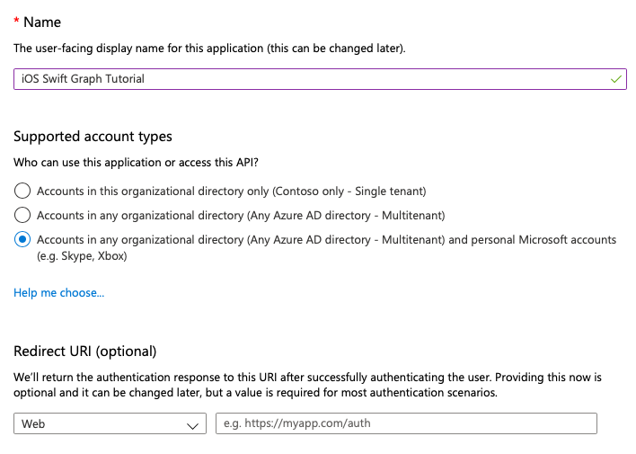

<!-- markdownlint-disable MD002 MD041 -->

Neste exercício, você criará um novo aplicativo nativo do Azure AD usando o centro de administração do Azure Active Directory.

1. Abra um navegador, navegue até o [centro de administração do Azure Active Directory](https://aad.portal.azure.com) e faça logon usando uma **conta pessoal** (também conhecida como conta da Microsoft) ou **Conta Corporativa ou de Estudante**.

1. Selecione **Azure Active Directory** na navegação esquerda e selecione **Registros de aplicativos** em **Gerenciar**.

    

1. Selecione **Novo registro**. Na página **Registrar um aplicativo**, defina os valores da seguinte forma.

    - Defina **Nome** para `iOS Swift Graph Tutorial`.
    - Defina **Tipos de conta com suporte** para **Contas em qualquer diretório organizacional e contas pessoais da Microsoft**.
    - Deixe o **URI de Redirecionamento** vazio.

    

1. Selecione **registrar**. Na página **tutorial do gráfico Swift do IOS** , copie o valor da **ID do aplicativo (cliente)** e salve-o, você precisará dele na próxima etapa.

    

1. Selecione **Autenticação** em **Gerenciar**. Selecione **Adicionar uma plataforma**e **Ios/MacOS**.

1. Insira a ID de pacote do aplicativo e selecione **Configurar**e, em seguida, selecione **concluído**.
