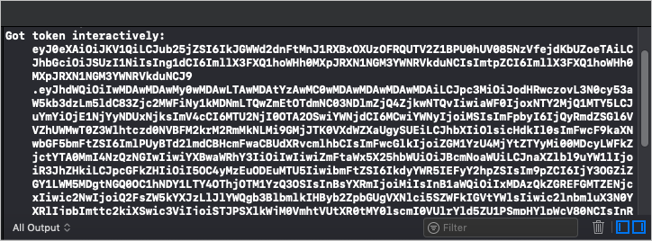

<!-- markdownlint-disable MD002 MD041 -->

Neste exercício, você estenderá o aplicativo do exercício anterior para oferecer suporte à autenticação com o Azure AD. Isso é necessário para obter o token de acesso OAuth necessário para chamar o Microsoft Graph. Para fazer isso, você integrará a [biblioteca de autenticação da Microsoft (MSAL) para IOS](https://github.com/AzureAD/microsoft-authentication-library-for-objc) no aplicativo.

1. Crie um novo arquivo de **lista de propriedades** no projeto do **GraphTutorial** chamado **AuthSettings. plist**.
1. Adicione os seguintes itens ao arquivo no dicionário **raiz** .

    | Chave | Tipo | Valor |
    |-----|------|-------|
    | `AppId` | String | A ID do aplicativo do portal do Azure |
    | `GraphScopes` | Matriz | Dois valores de cadeia `User.Read` de caracteres: e`Calendars.Read` |

    

> [!IMPORTANT]
> Se você estiver usando o controle de origem como o Git, agora seria uma boa hora para excluir o arquivo **AuthSettings. plist** do controle de origem para evitar vazar inadvertidamente sua ID de aplicativo.

## <a name="implement-sign-in"></a>Implementar logon

Nesta seção, você irá configurar o projeto para o MSAL, criar uma classe do Gerenciador de autenticação e atualizar o aplicativo para entrar e sair.

### <a name="configure-project-for-msal"></a>Configurar o Project para o MSAL

1. Adicione um novo grupo de chaves aos recursos do seu projeto.
    1. Selecione o projeto **GraphTutorial** e, em seguida, **assinaturas & recursos**.
    1. Selecione **+ recurso**e, em seguida, clique duas vezes em **compartilhamento de chaves**.
    1. Adicione um grupo de chaves com o valor `com.microsoft.adalcache`.

1. Control clique **info. plist** e selecione **abrir como**e, em seguida, **código-fonte**.
1. Adicione o seguinte no `<dict>` elemento.

    ```xml
    <key>CFBundleURLTypes</key>
    <array>
      <dict>
        <key>CFBundleURLSchemes</key>
        <array>
          <string>msauth.$(PRODUCT_BUNDLE_IDENTIFIER)</string>
        </array>
      </dict>
    </array>
    <key>LSApplicationQueriesSchemes</key>
    <array>
        <string>msauthv2</string>
        <string>msauthv3</string>
    </array>
    ```

1. Abra **AppDelegate. Swift** e adicione a seguinte instrução de importação na parte superior do arquivo.

    ```Swift
    import MSAL
    ```

1. Adicione a função a seguir à classe `AppDelegate`.

    :::code language="swift" source="../demo/GraphTutorial/GraphTutorial/AppDelegate.swift" id="HandleMsalResponseSnippet":::

### <a name="create-authentication-manager"></a>Criar o Gerenciador de autenticação

1. Crie um novo **arquivo Swift** no projeto **GraphTutorial** chamado **AuthenticationManager. Swift**. Adicione o código a seguir a esse arquivo.

    :::code language="swift" source="../demo/GraphTutorial/GraphTutorial/AuthenticationManager.swift" id="AuthManagerSnippet":::

### <a name="add-sign-in-and-sign-out"></a>Adicionar entrada e saída

1. Abra **SignInViewController. Swift** e substitua seu conteúdo pelo código a seguir.

    :::code language="swift" source="../demo/GraphTutorial/GraphTutorial/SignInViewController.swift" id="SignInViewSnippet":::

1. Abra **WelcomeViewController. Swift** e substitua a função `signOut` existente pelo seguinte.

    :::code language="swift" source="../demo/GraphTutorial/GraphTutorial/WelcomeViewController.swift" id="SignOutSnippet":::

1. Salve suas alterações e reinicie o aplicativo no simulador.

Se você entrar no aplicativo, verá um token de acesso exibido na janela de saída do Xcode.



## <a name="get-user-details"></a>Obter detalhes do usuário

Nesta seção, você criará uma classe auxiliar para manter todas as chamadas para o Microsoft Graph e atualizará `WelcomeViewController` o para usar essa nova classe para obter o usuário conectado.

1. Crie um novo **arquivo Swift** no projeto **GraphTutorial** chamado **graphmanager. Swift**. Adicione o código a seguir a esse arquivo.

    ```Swift
    import Foundation
    import MSGraphClientSDK
    import MSGraphClientModels

    class GraphManager {

        // Implement singleton pattern
        static let instance = GraphManager()

        private let client: MSHTTPClient?

        private init() {
            client = MSClientFactory.createHTTPClient(with: AuthenticationManager.instance)
        }

        public func getMe(completion: @escaping(MSGraphUser?, Error?) -> Void) {
            // GET /me
            let meRequest = NSMutableURLRequest(url: URL(string: "\(MSGraphBaseURL)/me")!)
            let meDataTask = MSURLSessionDataTask(request: meRequest, client: self.client, completion: {
                (data: Data?, response: URLResponse?, graphError: Error?) in
                guard let meData = data, graphError == nil else {
                    completion(nil, graphError)
                    return
                }

                do {
                    // Deserialize response as a user
                    let user = try MSGraphUser(data: meData)
                    completion(user, nil)
                } catch {
                    completion(nil, error)
                }
            })

            // Execute the request
            meDataTask?.execute()
        }
    }
    ```

1. Abra **WelcomeViewController. Swift** e adicione a seguinte `import` instrução na parte superior do arquivo.

    ```Swift
    import MSGraphClientModels
    ```

1. Adicione a propriedade a seguir à `WelcomeViewController` classe.

    ```Swift
    private let spinner = SpinnerViewController()
    ```

1. Substitua o existente `viewDidLoad` pelo código a seguir.

    :::code language="swift" source="../demo/GraphTutorial/GraphTutorial/WelcomeViewController.swift" id="ViewDidLoadSnippet":::

Se você salvar suas alterações e reiniciar o aplicativo agora, após entrar, a interface do usuário será atualizada com o nome de exibição e o endereço de email do usuário.
